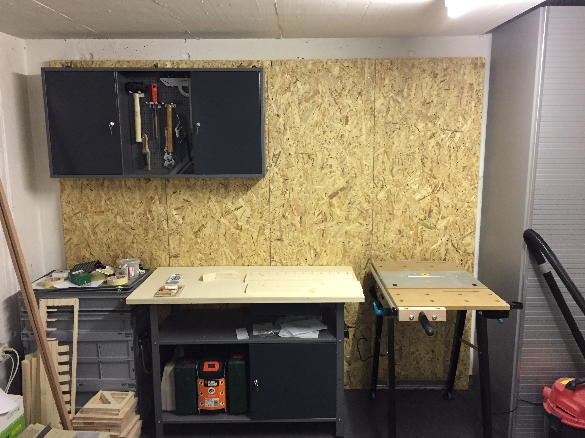
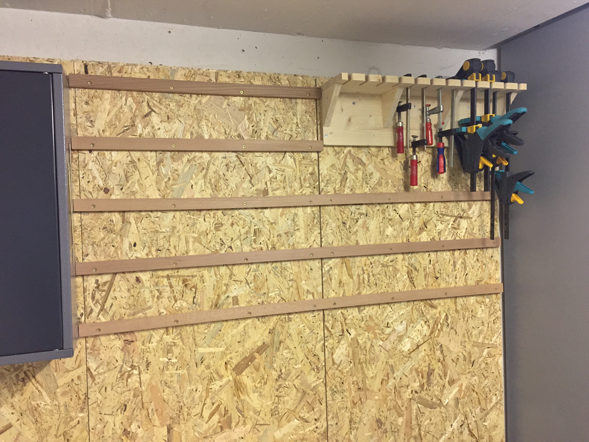
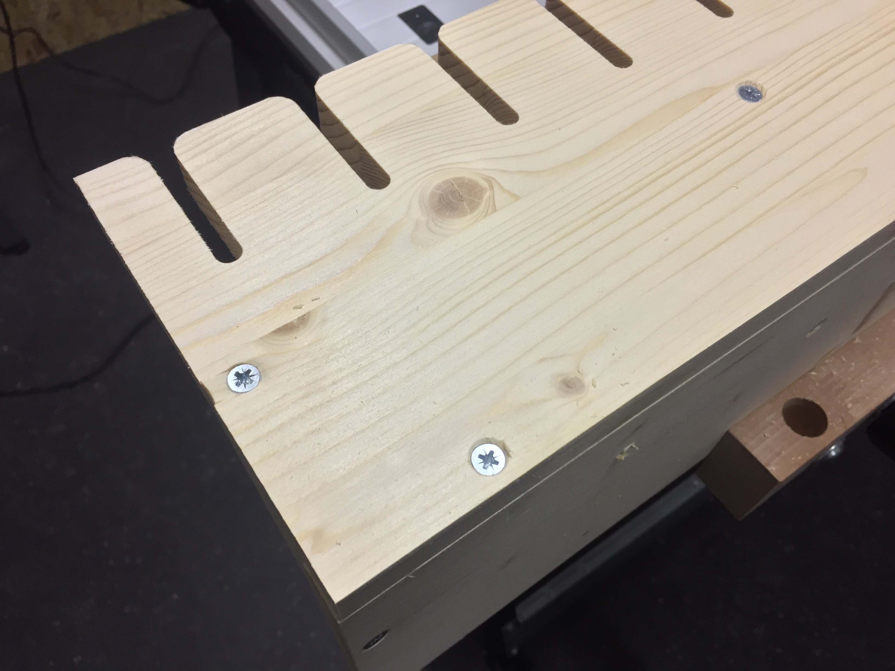
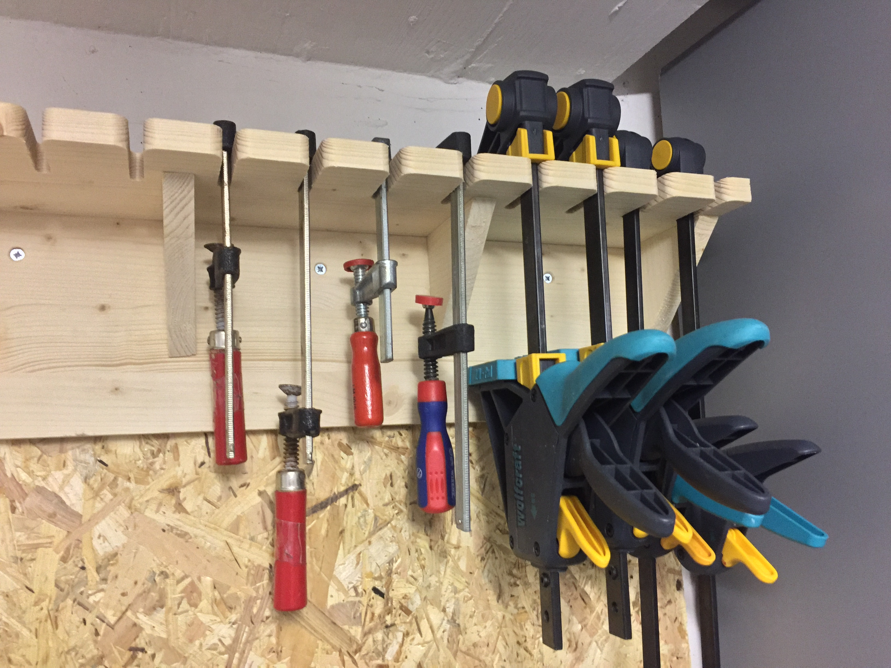
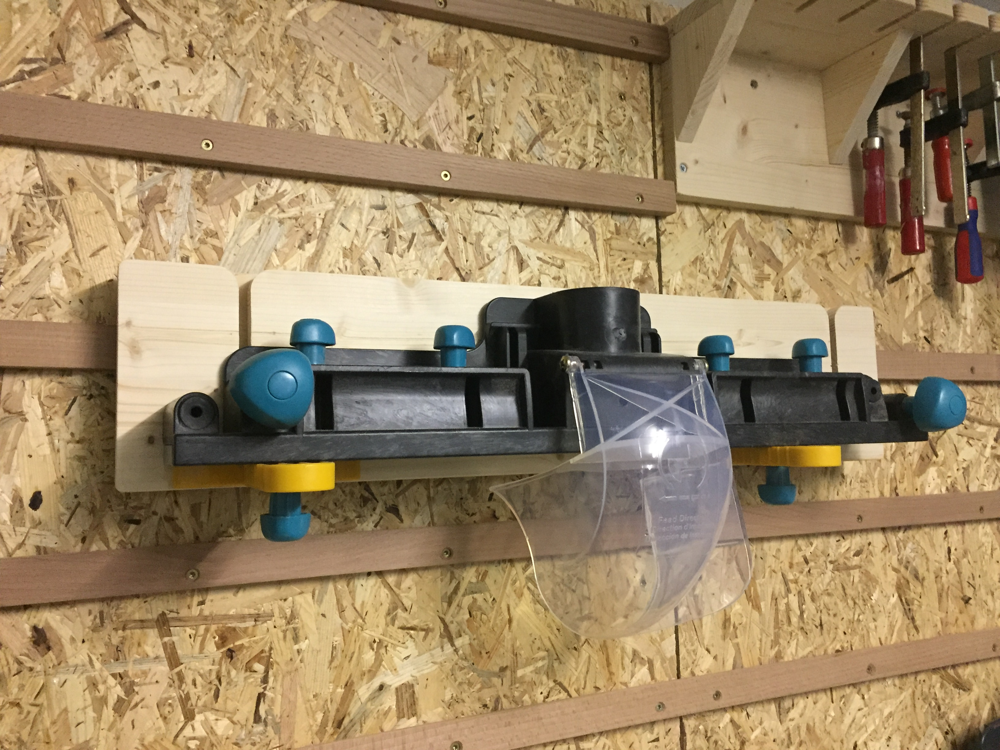

# Werkzeug Halter

Ich wollte meine verschiedenen Werkzeuge Halterungen für eine Montage an der Wand bauen. Deshalb habe ich mich für ein [French-Cleat](https://en.wikipedia.org/wiki/French_cleat) System entschieden.

## Spann Zangen

## Parallel Fräsanschlag

